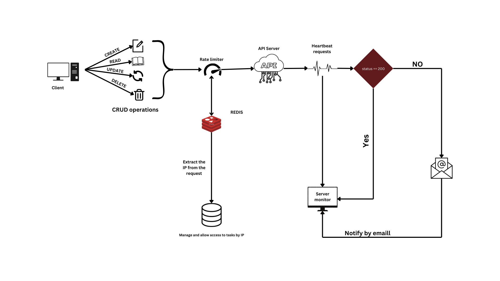

# Task_Tracker API

The Task_Tracker API is a FastAPI application that provides CRUD functionalities for task management. It includes a Redis rate limiter to control the frequency of requests from different IP addresses. Users are differentiated by their IP addresses, and this information is stored in a Redis key-value database. Additionally, the API implements CORS to allow external sources to fetch information.



## Features

1. **CRUD Operations**: The API supports Create, Read, Update, and Delete operations for managing tasks.

2. **Rate Limiter**: Redis rate limiter is employed to control and limit the number of requests from different IP addresses.

3. **User Differentiation**: Users are differentiated based on their IP addresses, ensuring that each user only has access to tasks associated with their IP.

4. **CORS Support**: Cross-Origin Resource Sharing (CORS) is implemented to allow external sources to fetch information from the API.

5. **Heartbeat Checker**: The API includes a heartbeat checker that monitors the status of the API. If the status is not equal to 200, an email notification is sent to alert administrators.


## Prerequisites

Before you begin, make sure you have the following installed:

- Docker
- Docker Compose

## Getting Started

1. Clone the repository:
    ```bash
    git clone https://github.com/ismail-lagziri/Task_Tracker.git
    ```

2. Navigate to the project directory:
    ```bash
    cd Task_Tracker
    ```

3. Configure the necessary environment variables in the Dockerfile located in the root of the project:
    ```bash
    SERVER_HOST=0.0.0.0
    SERVER_PORT=8000
    ```

## Build and Run

Build and run your Docker container using Docker Compose:
```bash
docker-compose build
docker-compose up
```
The **Task_Tracker** API should now be accessible at http://${SERVER_HOST}:${SERVER_PORT}

## Turn it off

```bash
docker-compose down
```

## API Endpoints

- **GET /tasks**: Retrieve a list of tasks.
- **GET /tasks/{task_id}**: Retrieve details of a specific task.
- **POST /tasks**: Create a new task.
- **PUT /tasks/{task_id}**: Update details of a specific task.
- **DELETE /tasks/{task_id}**: Delete a specific task.

## Rate Limiting

The API enforces rate limiting to prevent abuse. Users exceeding the specified rate limit will receive a 429 (Too Many Requests) HTTP status code.

## CORS Configuration

Cross-Origin Resource Sharing is configured to allow specific external domains to fetch data from the API. Update CORS settings in `main.py` as needed.

## Heartbeat Checker

The heartbeat checker runs in the background, periodically checking the API's status. If the status is not 200, an email notification will be sent. Configure email settings in `main.py` and  `utils.py`.

## Contributing

Feel free to contribute to the development of this API by opening issues or submitting pull requests.

## Note
### All remarks and suggestions are encouraged

